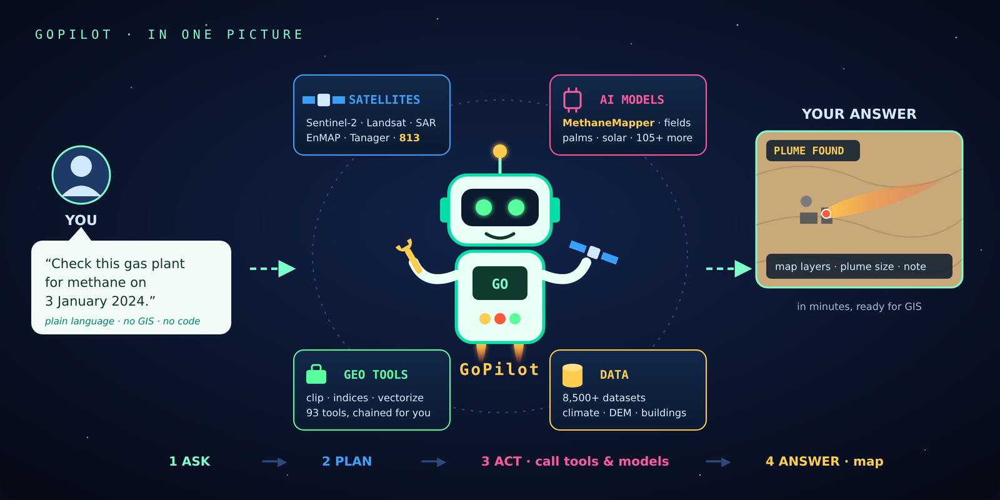
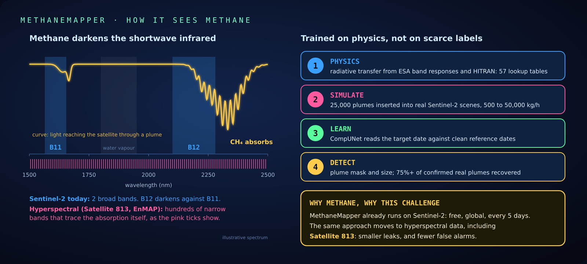

# GoPilot × Challenge 813: methane plumes from one sentence

**Arab Youth Space Hackathon 2026, Challenge 813 · Theme 06: Air Quality & Environmental Intelligence**

## 1. Title and summary

**GoPilot** is RASID's geospatial AI agent. You ask it, in plain language, to check a gas facility for
methane on a given date. It finds the Sentinel-2 scenes, runs **MethaneMapper**, our own methane model trained on
physically simulated plumes, and returns the plume as map layers.

This repository is a reproducible proof of concept. One notebook flies four missions through GoPilot and shows
the results on maps:
- methane over an oil-and-gas area in central Bahrain;
- date palms in the Al-Ahsa oasis;
- solar panels in Dubai;
- farm fields in the Val d'Orcia, Tuscany.



## 2. Business use case

| Who | What they get |
|---|---|
| Oil and gas operators (LDAR, ESG teams) | Find large leaks from space and fix them before they become a reporting or safety problem |
| Regulators and environment agencies | Screen many facilities from Sentinel-2 without a field campaign |
| MRV and carbon verifiers | An independent, repeatable check on reported emissions |

GoPilot is already in market: in the browser at [app.rasid.ai](https://app.rasid.ai), in ArcGIS Pro and QGIS,
and as an API, with paying users. The methane check is one request, priced per use. The user needs no GIS skills
and no code.

## 3. Problem

Methane warms about 80 times more than CO₂ over 20 years. A small number of oil and gas point sources emit a
large share of it, and many are in the Arab region. Finding them still takes aircraft campaigns or a specialist
working through satellite data by hand. Sentinel-2 sees many of these plumes for free, every 5 days. What was
missing is a model that reads the signal reliably, and a way for a non-specialist to use it.

## 4. Data used

| Product | Provider | Dates | Processing level | Licence |
|---|---|---|---|---|
| Sentinel-2 MSI (methane mission) | ESA Copernicus, via Element84 Earth Search (AWS Open Data) | target 2026-07-22, two clean references within the 60 days before | **L1C** (what MethaneMapper uses) | Free, full and open; *contains modified Copernicus Sentinel data* |
| Sentinel-2 MSI (physics sample input) | same | 2026-07-28 and 2026-07-30 (a large methane plume in Kazakhstan) | **L2A** (public) | same |
| Mapbox Satellite (palm and solar missions) | Mapbox, Maxar | most recent mosaic | RGB, about 30 cm | © Mapbox © Maxar, used through GoPilot |
| Google Satellite (field mission) | Google, Maxar et al. | most recent mosaic | RGB, ~2.4 m at zoom 16 | © Google, used through GoPilot |
| Esri World Imagery (basemaps only) | Esri | current | RGB tiles | Esri terms, attribution on every map |

Hyperspectral data is **not** used in this PoC. MethaneMapper's physics carries over to hyperspectral sensors such
as Satellite 813, which is the next step (§9).

## 5. Technical approach



1. **Agent.** GoPilot (Claude on Amazon Bedrock AgentCore) reads the request and plans the job. It then calls our
   GoServer tool servers (MCP, serverless GPUs): geocoding, Sentinel-2 search and download, models, and file
   packaging.
2. **Physics.** Methane absorbs in Sentinel-2's B12 (~2190 nm) and barely in B11 (~1610 nm). So on the target date,
   B12/B11 drops where a plume is, compared with clean reference dates:
   `frac = 1 − (B12′/B11′)/(B12/B11)`.
3. **Synthetic training data.** We ran radiative transfer with ESA band responses and HITRAN (57 lookup tables), and
   simulated 25,000 Gaussian-puff plumes inserted into real Sentinel-2 L1C scenes at 500–50,000 kg/h. This gives
   exact labels, which real data cannot.
4. **Model.** CompUNet: a shared ResNet-34 encoder over the target and every reference scene, with references
   pooled per scale, and a U-Net decoder producing a plume mask. It was trained only on synthetic plumes, and
   recovers 75%+ of confirmed real Sentinel-2 plume events.
5. **Output.** Plume polygons (GeoJSON) and, when produced, index rasters (Cloud-Optimised GeoTIFF), with
   GoPilot's styling, shown here as a static postcard and as an interactive map.

## 6. Installation

Python **3.11**.

```bash
git clone https://github.com/rasid-ai/gopilot_methane_813_arab_youth.git
cd gopilot_methane_813_arab_youth
python3.11 -m venv .venv
source .venv/bin/activate          # Windows: .venv\Scripts\activate
pip install -r requirements.txt
```

**Credentials are optional.** Without them the notebook replays our recorded GoPilot missions from `results/`.
To fly the missions live, copy `creds.env.example` to `creds.env` at the repo root and fill it in (git ignores
`creds.env`), or set the same names as environment variables. Judges receive the values with the submission:

| Variable | What it is |
|---|---|
| `AWS_ACCESS_KEY_ID`, `AWS_SECRET_ACCESS_KEY` | An IAM user that can only call the GoPilot runtime (`bedrock-agentcore:InvokeAgentRuntime`). RASID can revoke it at any time. |
| `GOPILOT_AGENT_ARN` | The GoPilot runtime to call |
| `GOPILOT_REGION` | `eu-central-1` |

## 7. How to run

```bash
jupyter lab notebooks/GoPilot_813.ipynb
```

Then **Run → Restart Kernel and Run All Cells**.
- **Replay** (no credentials): about 2 minutes. Each mission replays its recorded run in about 20 s.
- **Live** (`creds.env` filled in): the methane mission takes a few minutes, and the others 1–3 minutes each.
- **Final output:** for each mission, a console of what GoPilot did, a postcard of the result, and an interactive
  map.
- **Change the request:** edit the prompt in any mission cell. Name a facility, a date and a small box.
- **Re-record a mission:** set `GOPILOT_RECORD=1` and run it live. The recording goes to `results/<mission>/`,
  with every signed download link replaced by a local file.
- **Colab:** upload the notebook. Its first cell clones this repo.

The notebook's cells only fly missions. The code behind them is in `src/gopilot813/`:

| File | What it holds |
|---|---|
| `config.py` | finds the repo, reads credentials, chooses live or replay |
| `console.py` | the GoPilot client, recording and replay, and the mission console |
| `maps.py` | the postcard and the interactive map, styled with GoPilot's own layer styles |
| `physics.py` | the raw B12/B11 signal on the sample input |

## 8. Example input and output

**Input:** one sentence. The sample of the area GoPilot works on is in `data/sample_input/`: two 4 × 4 km
Sentinel-2 clips of a large methane plume in Kazakhstan (UNEP IMEO MARS source KAZ_S_185), and `scenes.json`
with the exact scene IDs, dates and box. `python data/sample_input/fetch_sample.py` recreates them from the
public archive.

**Output:** in `results/<mission>/`: the recorded stream, the layers GoPilot returned (`files/`) and `meta.json`.

## 9. Results and limitations

**Results.** Each recorded mission is in `results/`. The notebook replays them through the same console and maps.

**Limitations:**
- Sentinel-2's 20 m SWIR sees large point sources: roughly hundreds of kg/h and up, depending on surface and sun.
  Small leaks are below it.
- Bright, dark or wet surfaces and sharp edges can mimic the B12/B11 signal. The notebook's physics cell shows the
  raw signal on the sample input: a ~288,000 kg/h plume stands out clearly, but ordinary surface changes can produce
  the same B12/B11 drop. Clean reference dates and the trained model reduce false alarms, but do not remove them.
- A plume is only seen on a clear overpass, about every 5 days.
- GoPilot is an agent: between runs it can choose different reference dates. The recorded runs are the ones shown.
- **Next:** the same physics on hyperspectral sensors (EnMAP, Tanager, Satellite 813). Hundreds of narrow bands
  across the methane absorption should mean smaller detectable leaks and fewer false alarms.

## 10. Team, licence and attribution

**Team:** RASID. *Registered members: \<names as registered on the hackathon platform\>.*
[rasid.ai](https://www.rasid.ai) · info@rasid.ai

**Licence:** the code in this repository is MIT (see `LICENSE`). GoPilot, GoServer and MethaneMapper are RASID
proprietary and are used here as a service.

**Attribution:** contains modified Copernicus Sentinel data (2021–2026), processed by ESA and accessed through
Element84 Earth Search on AWS Open Data. Basemaps © Esri, Maxar, Earthstar Geographics. VHR imagery © Mapbox
© Maxar. MethaneMapper: A. Ghandour (CNRS-L), H. Nasrallah (RASID), with C. Nattero, N. Ginatta and A. Pescino
(FusionAILabs).
